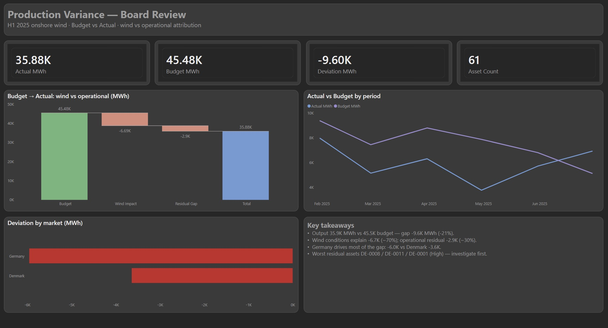
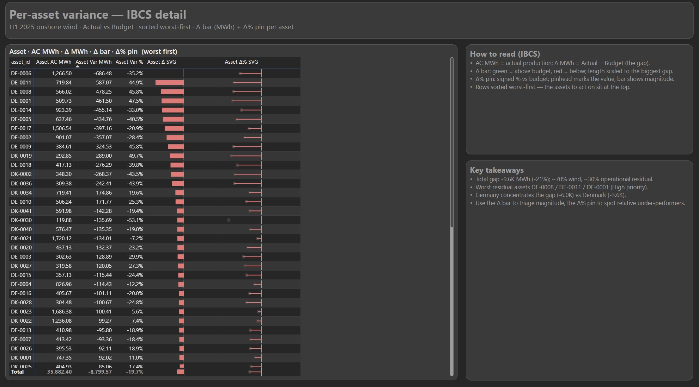
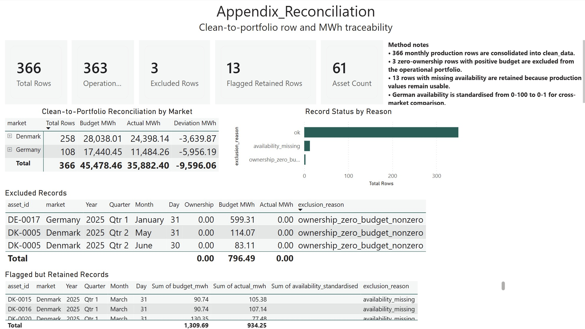
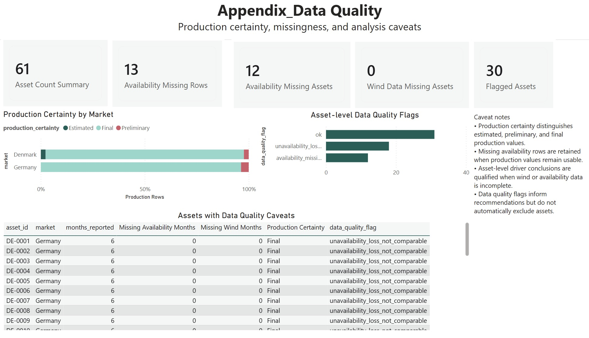

# Performance Variance Reporting with Power BI

Portfolio v0 based on a real-world performance reporting problem from a Danish business context, using processed and anonymized data to demonstrate KPI definitions, budget-vs-actual variance analysis, data quality handling, and selected Power BI report pages.

This repository is not presented as a fully finished dashboard product. The current public version focuses on the reporting workflow: Python ETL, cleaned reporting tables, Power BI model notes, a public DAX measure library, and selected report page screenshots for management review and asset-level follow-up.

No raw source files, company names, or confidential business information are included.

## Business Context

Management needs a reliable reporting view to understand performance against budget, explain the main variance drivers, and identify which assets require follow-up. The reporting problem is common in finance and performance analytics teams: operational data is available, but it needs to be standardized into consistent KPIs, quality checks, and management-facing reporting logic.

The public version keeps the structure of the business problem while using processed and anonymized data only.

The core questions are:

- Are assets performing above or below budget?
- Which market or asset group drives the total variance?
- How much of the gap is linked to wind conditions versus residual or operational factors?
- Which assets should management investigate first?
- Which data quality issues affect reporting confidence?

## Why This Is Not a Student Dashboard

This project is structured as a business reporting workflow rather than a one-off visualization exercise.

It includes:

- Repeatable Python ETL for preparing reporting tables
- Processed reporting datasets for Power BI
- Power BI model structure and DAX measure documentation
- DAX measures for budget, actual, deviation, variance bridge, data quality, and asset-level follow-up
- Data quality and exclusion logic
- Selected report pages for board review and asset-level variance follow-up
- KPI and methodology documentation

The focus is reporting reliability, KPI definitions, business interpretation, and decision support.

## Danish Business Context

The case is based on a real-world performance reporting problem from a Danish business context and converted into a public portfolio version.

It reflects reporting themes often seen in Danish and Nordic finance, BI, and performance analytics roles:

- Recurring management reporting
- Budget-vs-actual performance review
- Cross-market reporting
- KPI consistency
- Data quality transparency
- Power BI-based reporting packages
- Reducing manual reporting through repeatable data preparation
- Translating business questions into analytical requirements

## Tools

- Power BI
- DAX
- Power Query
- Python
- pandas
- Excel-derived reporting structure
- CSV reporting tables

## Repository Structure

```text
data/processed/          Processed and anonymized reporting tables
src/                     Python ETL script
screenshots/             Current selected report page screenshots
docs/                    KPI, pipeline, and status documentation
```

Note: the PBIX/PBIP files are not included in the public v0 because the report layout and navigation are still being refined. Power BI evidence is shown through screenshots, model notes, and a public DAX measure library.

## Data Pipeline

```text
Processed/anonymized source structure
        -> Python ETL and business-rule transformation
        -> Clean reporting tables
        -> Power Query ingestion and schema typing
        -> Power BI semantic model
        -> DAX measures
        -> Selected Power BI report pages
```

See [docs/data_pipeline.md](docs/data_pipeline.md) for more detail.
See [docs/powerbi_model_notes.md](docs/powerbi_model_notes.md) for the current model notes.
See [docs/dax_measures.md](docs/dax_measures.md) for the public DAX measure library.
See [docs/dax_validation.md](docs/dax_validation.md) for the static validation notes.

## Selected Report Pages

### Board Review



The board review page gives management a compact view of actual production, budget, total deviation, market-level variance, and a wind-versus-residual attribution bridge.

### Asset Detail



The asset detail page supports operational follow-up by ranking underperforming assets and showing both absolute and relative variance.

## Supporting Appendix Pages

### Reconciliation Appendix



The reconciliation appendix documents how rows and MWh values move from the cleaned dataset into the operational portfolio view, including excluded records and retained caveats.

### Data Quality Appendix



The data quality appendix makes production certainty, missingness, and analysis caveats visible so that performance conclusions can be interpreted with the right confidence level.

## KPI Logic

Core measures include:

- Actual MWh
- Budget MWh
- Deviation MWh
- Deviation %
- Wind Impact MWh
- Residual Gap
- Asset Count
- Investigation Priority
- Data Quality Flag

See [docs/kpi_definitions.md](docs/kpi_definitions.md) for definitions.

## Current Status

This repository is a portfolio v0.

Completed:

- Processed and anonymized reporting dataset
- Python ETL pipeline
- Power BI model notes and DAX measure library
- DAX measures for the selected report pages
- Board review report page
- Asset-level variance detail page
- Reconciliation and data quality appendix screenshots
- KPI and data quality logic

In progress:

- Final dashboard polish
- Additional report navigation
- Screenshot walkthrough
- Final DAX naming and formatting cleanup before any later PBIX release
- Optional SQL/PostgreSQL-style source layer documentation

See [docs/project_status.md](docs/project_status.md).

## Confidentiality Boundary

This public repository contains only processed and anonymized data. It does not include raw source files, company names, internal business documents, or confidential business information.
